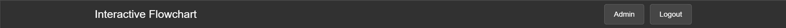
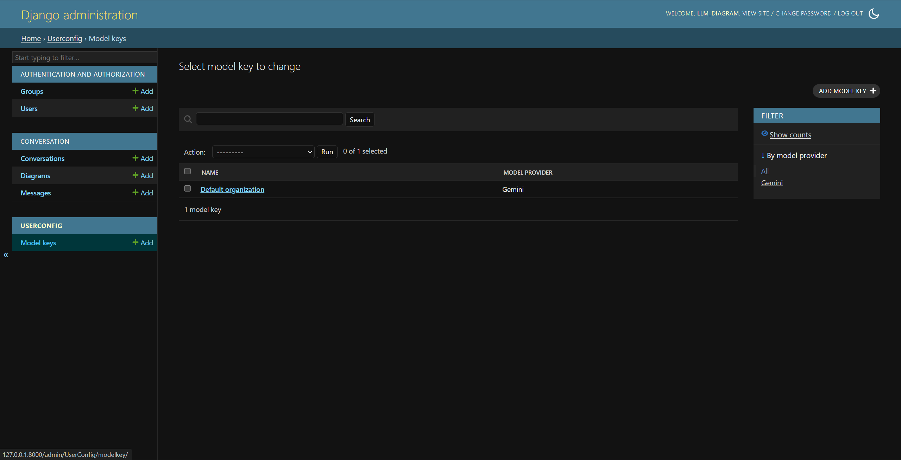
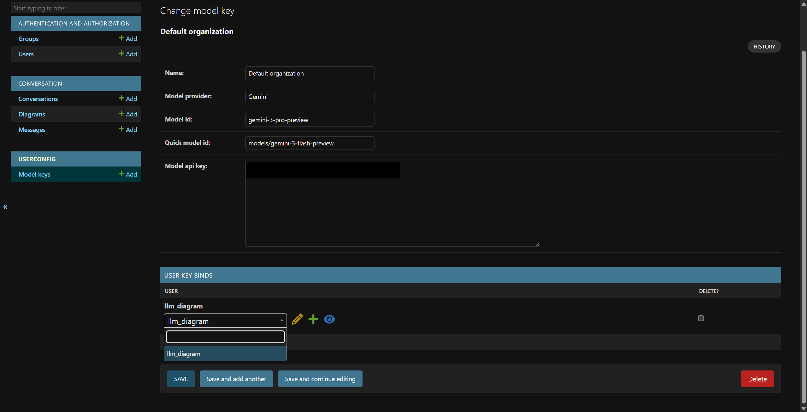

# Interactive music
Discuss, describe, and generate music with large language models


[TOC]


## Install

Create a text file `config.yaml` of YAML format in the program's root directory. Add the following key-value pairs into this file.

| Key                        | Value type | Description                                                  |
| -------------------------- | ---------- | ------------------------------------------------------------ |
| `secret_key`               | `str`      | Django application's secret key. Generate the key at [Djecrety](https://djecrety.ir/) website, or use any string of 50 random ASCII characters. |
| `default_model_provider`   | `str`      | Default large language model provider. <br />Options: `gemini` |
| `default_model_id`         | `str`      | Model ID of default large language model for main functions (chat, summary, draw diagrams). This model usually has strong intelligence. |
| `conv_title_model_id`      | `str`      | Model ID of the large language model to generate conversation title. This model usually is smaller and cheaper model. |
| `draw_diagram_max_retries` | `int`      | Number of times to retry when the model fails to generate a diagram, usually fails to render because of syntax error. |

Create a Python virtual environment and activate. Run the following command.

```
pip install -r requirements.txt
python manage.py migrate
python manage.py createsuperuser
```

Follow the instruction in the command line, to create a super user.


## Usage

Run the following command.

```
python manage.py runserver
```

By default, it deploys the website to https://localhost:8000 The target location can be customized; refer to [Django documentation](https://docs.djangoproject.com/en/6.0/ref/django-admin/#runserver).

The following instructions assume you deploy to the default location, unless in topic of deploying.


### Allocate large language model resources to users

Log in staff account. Click "Admin" in the main page after logged in.



In "USERCONFIG" application, "Model keys" table, create a new object.



Fill in the organization name, API key from large language model provider. You can customize the model provider and model IDs, but they should match the API key.

>   [!NOTE]
>
>   Currently, only Gemini API is integrated. You can use other providers whose API is compatible to Gemini.

Add users who will have access to this large language model to "USER KEY BINDS" table.

>   [!TIP]
>
>   Delete user here only removes there access to the large language model, but won't delete their account.



### Light & dark theme

The program determines light or dark theme according to the user's browser settings. For example, if the user uses Chrome browser, the program will show dark theme if "Settings > Appearance > Mode" is "Dark". Technically, it implements dark theme CSS in `@media (prefers-color-scheme: dark)` tag.


### Generate music

