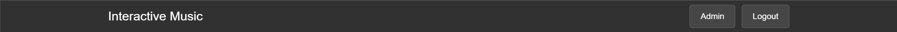
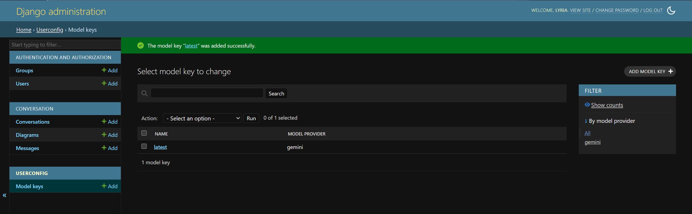
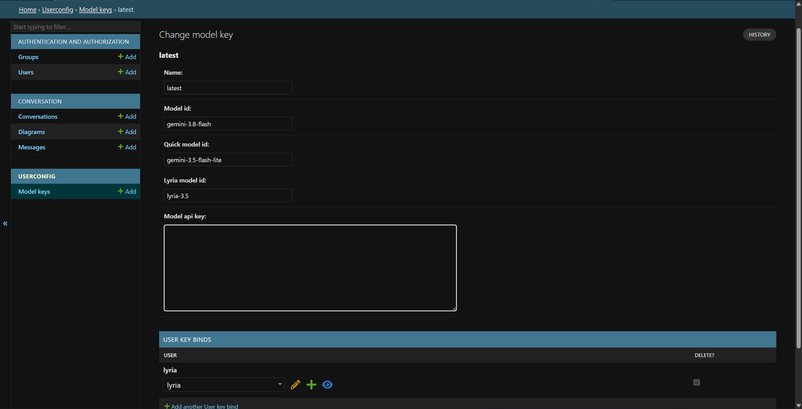
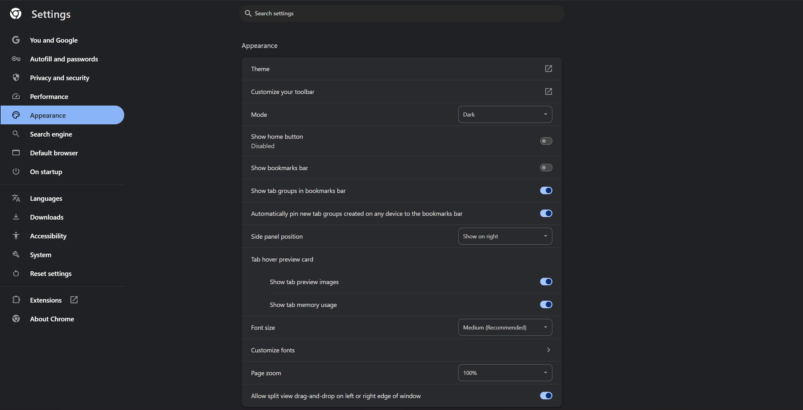

# Interactive music
Discuss, describe, and generate music with large language models


## Install

Create `.env` file and define the following environment variables. [Format](https://github.com/env-lang/env/blob/main/env.md)

| Name       | Data type | Description                                                  |
| ---------- | --------- | ------------------------------------------------------------ |
| SECRET_KEY | str       | Django application's secret key. Generate the key at [Djecrety](https://djecrety.ir/) website, or use any string of 50 random ASCII characters. |

Create a Python virtual environment and activate.

Run the following commands in PowerShell.

```
pip install -r requirements.txt
.\set_env.ps1
python manage.py migrate
```

Create a super user. [Guidance](https://www.w3schools.com/django/django_admin_create_user.php)


## Usage

### Start server

Run the following commands in PowerShell.

```
.\set_env.ps1
python manage.py runserver
```

By default, it deploys the website to https://localhost:8000 The target location can be customized; refer to [Django documentation](https://docs.djangoproject.com/en/6.0/ref/django-admin/#runserver).

The following instructions assume you deploy to the default location, unless in topic of deploying.

### Config access to models

Log in staff account. Click "Admin" in the main page after logged in.



In "USERCONFIG" application, "Model keys" table, create a new object.



Give a customized name, API key from Google AI Studio, and set models' ID for different purposes:

-   Model ID: respond the user in conversations; conclude conversation into Google Lyria prompts.
-   Quick model ID: generate title of the conversation.
-   Lyria model ID: Google Lyria model for music generation.



Add users to the model configuration profile in "USER KEY BINDS" section.

>   [!TIP]
>
>   Delete user here only removes there access to large language models, but won't delete their account.

### Light & dark theme

The program determines light or dark theme according to the user's browser settings. For example, if they use Chrome browser, the program will show dark theme if "Settings > Appearance > Mode" is "Dark". Technically, it implements dark theme CSS in `@media (prefers-color-scheme: dark)` tag.



